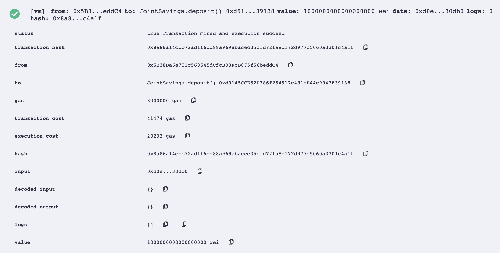
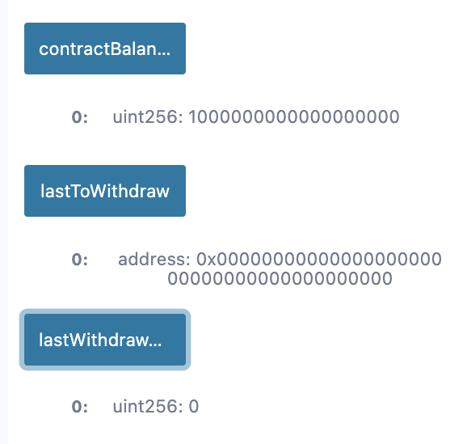
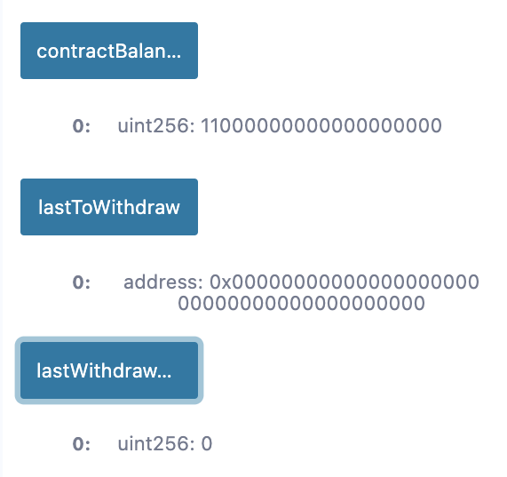
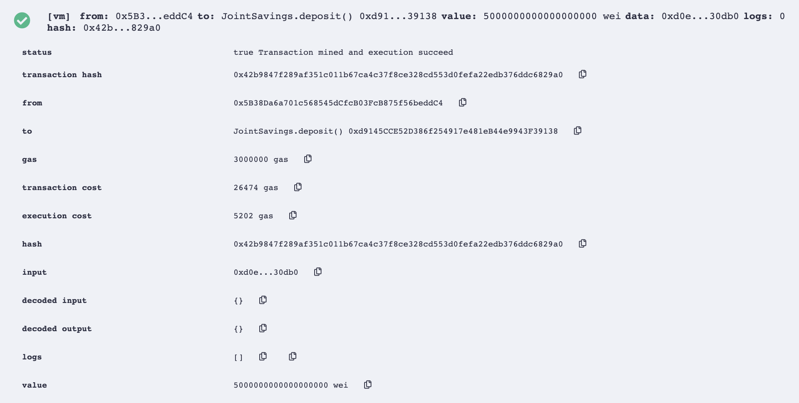
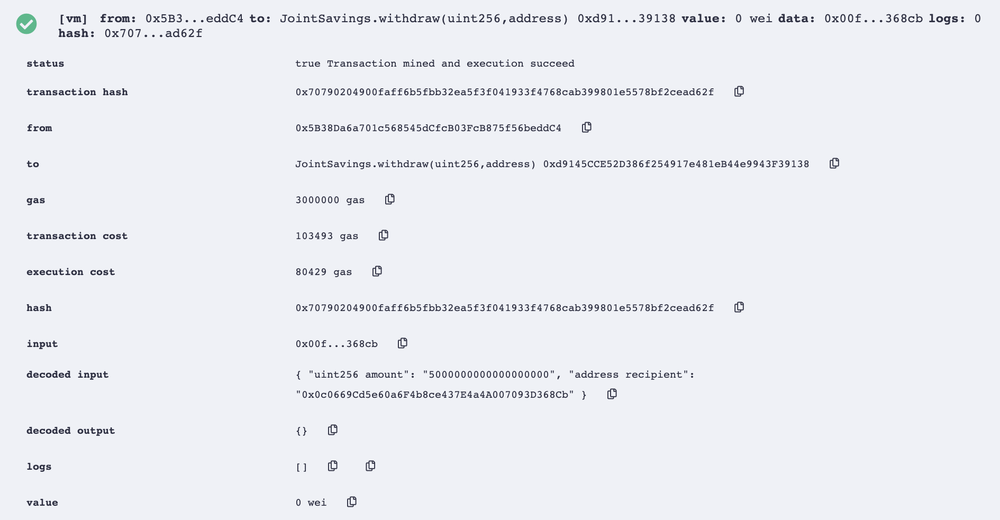
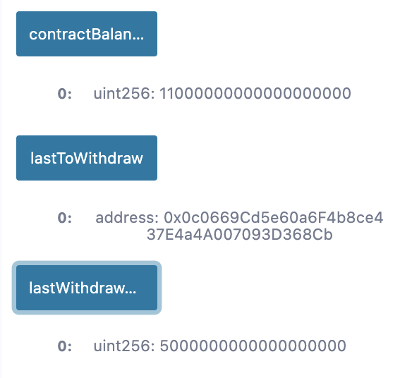
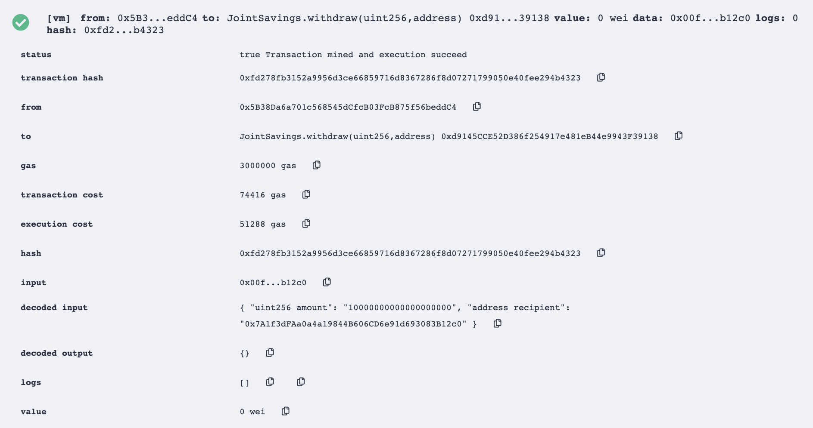
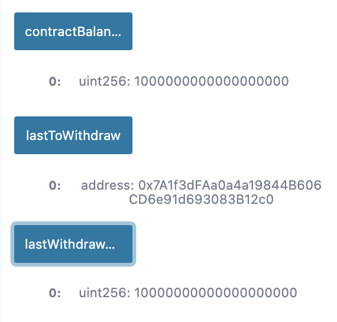

# Joint Savings Smart Contract 

---

## Technologies

All technology utilized in this module is encompassed in the [Remix Ethereum IDE](https://remix-project.org/). 

---

## Installation Guide

No installation required; all development is hosted in the _Remix Ethereum IDE_.

---

## Execution Results

This section entails execution results of a joint savings account hosted via a _Solidity_ smart contract. The following accounts will be utilized:

* `0x0c0669Cd5e60a6F4b8ce437E4a4A007093D368Cb` - Account 1

* `0x7A1f3dFAa0a4a19844B606CD6e91d693083B12c0` - Account 2

### Accounts Setup

[Account Setup](./Execution_Results/setAccounts.png)

### Ether Deposit

For this example, we will deposit 16 ether into the smart contract.

#### Deposit 1 Ether

#### Deposit 10 Ether

![Deposit 10 Ether)(./Execution_Results/deposit_10_ether.png)

#### Deposit 5 Ether

### Withdrawals

To demonstrate the withdrawal functionality of this smart contract, we will be withdrawing 5 and 10 ether into Account 1 and Account 2, respectively.

#### Withdraw 5 Ether

#### Withdraw 10 Ether

## Usage

Upload the `joint_savings.sol` file into the Remix Ethereum IDE and compile. 

---

## Contributors

New development created by Aaron C. Montano. **Code from 'Initial commit.' commit originates from UC Berkeley Extension and I do not claim original ownership nor scholarship**.

---

## License

Software tool available for public use. 
